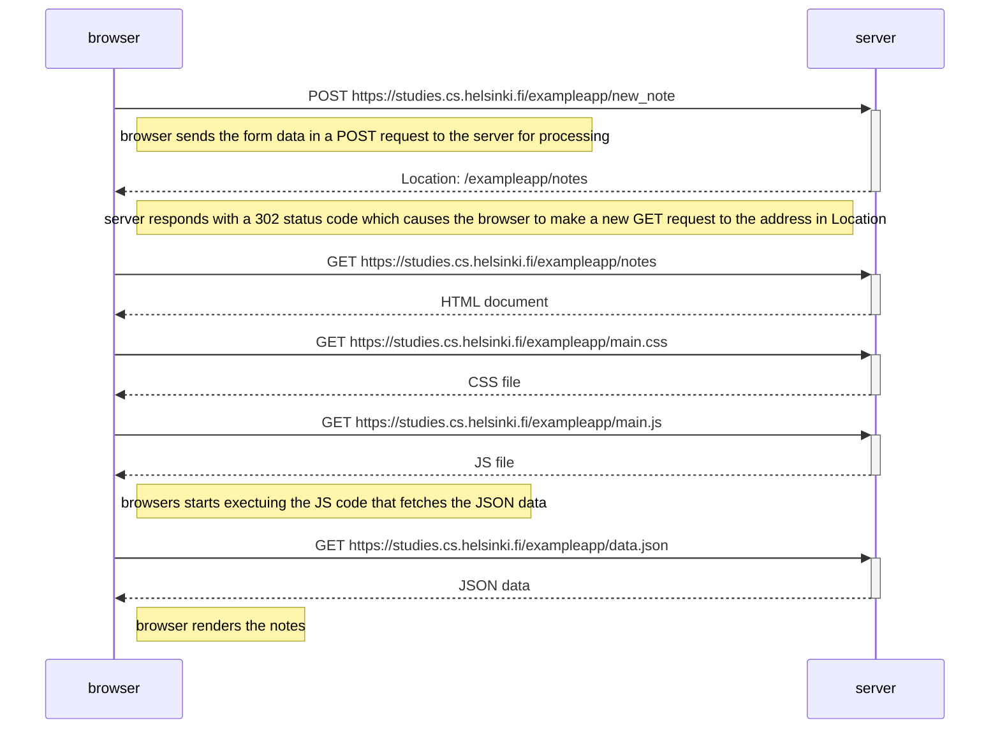

```mermaid
sequenceDiagram
    participant browser
    participant server

    browser->>+server: POST https://studies.cs.helsinki.fi/exampleapp/new_note
    Note right of browser: browser sends the form data in a POST request to the server for processing
    server-->>-browser: Location: /exampleapp/notes
    Note right of browser: server responds with a 302 status code which causes the browser to make a new GET request to the address in Location

    browser->>+server: GET https://studies.cs.helsinki.fi/exampleapp/notes
    server-->>-browser: HTML document

    browser->>+server: GET https://studies.cs.helsinki.fi/exampleapp/main.css
    server-->>-browser: CSS file

    browser->>+server: GET https://studies.cs.helsinki.fi/exampleapp/main.js
    server-->>-browser: JS file
    Note right of browser: browsers starts exectuing the JS code that fetches the JSON data

    browser->>+server: GET https://studies.cs.helsinki.fi/exampleapp/data.json
    server-->>-browser: JSON data
    Note right of browser: browser renders the notes
```