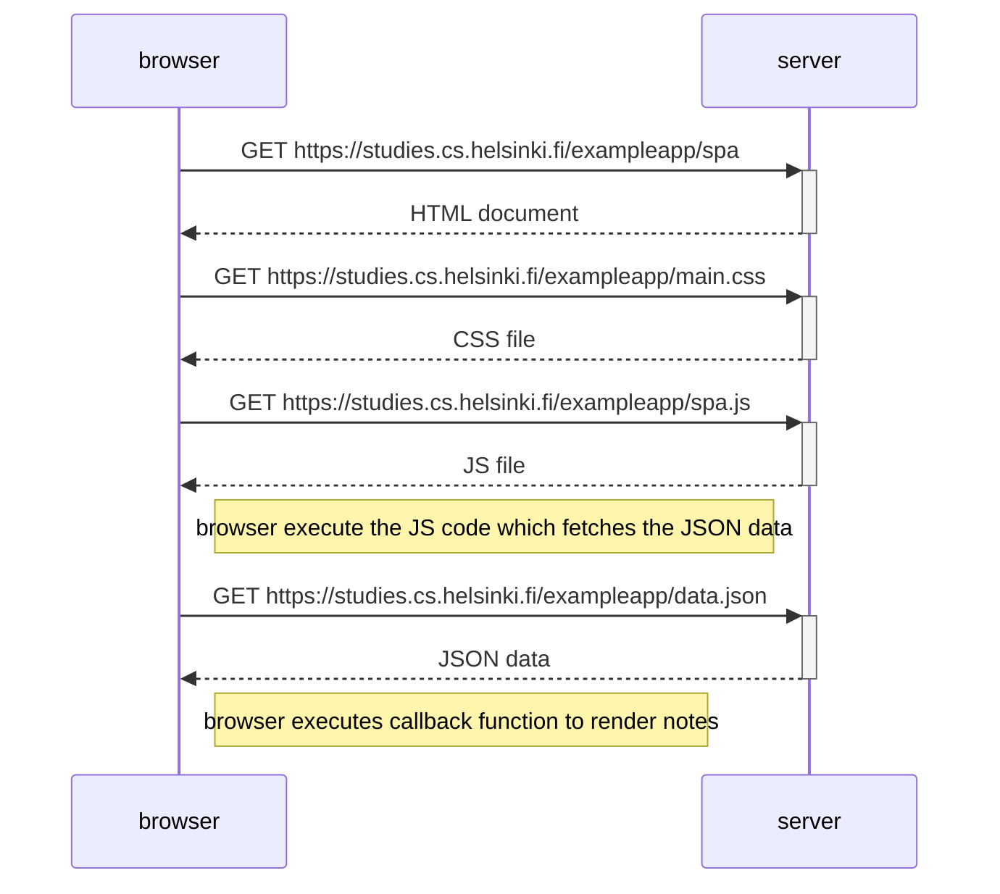

```mermaid
sequenceDiagram
    participant browser
    participant server

    browser->>+server: GET https://studies.cs.helsinki.fi/exampleapp/spa
    server-->>-browser: HTML document

    browser->>+server: GET https://studies.cs.helsinki.fi/exampleapp/main.css
    server-->>-browser: CSS file

    browser->>+server: GET https://studies.cs.helsinki.fi/exampleapp/spa.js
    server-->>-browser: JS file

    Note right of browser: browser execute the JS code which fetches the JSON data

    browser->>+server: GET https://studies.cs.helsinki.fi/exampleapp/data.json
    server-->>-browser: JSON data

    Note right of browser: browser executes callback function to render notes
```