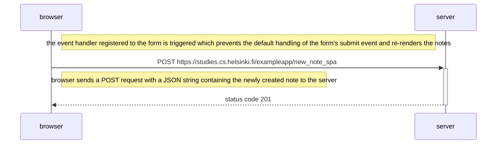

```mermaid
sequenceDiagram
    participant browser
    participant server

    Note right of browser: the event handler registered to the form is triggered which prevents the default handling of the form's submit event and re-renders the notes
    browser->>+server: POST https://studies.cs.helsinki.fi/exampleapp/new_note_spa
    Note right of browser: browser sends a POST request with a JSON string containing the newly created note to the server
    server-->>-browser: status code 201
```